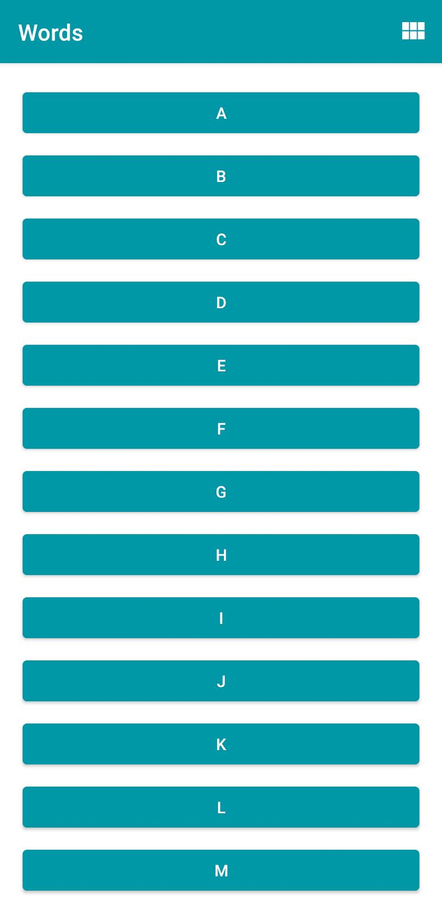

# Words App

## :page_facing_up: Project
App de dicionário simples feito em Kotlin, com uma lista de letras, palavras para cada letra e a capacidade de procurar definições de cada palavra no navegador. Criado para aprender RecyclerView, navegação entre Fragments, modificar o header e implementar uma Intent.

  
  
  

